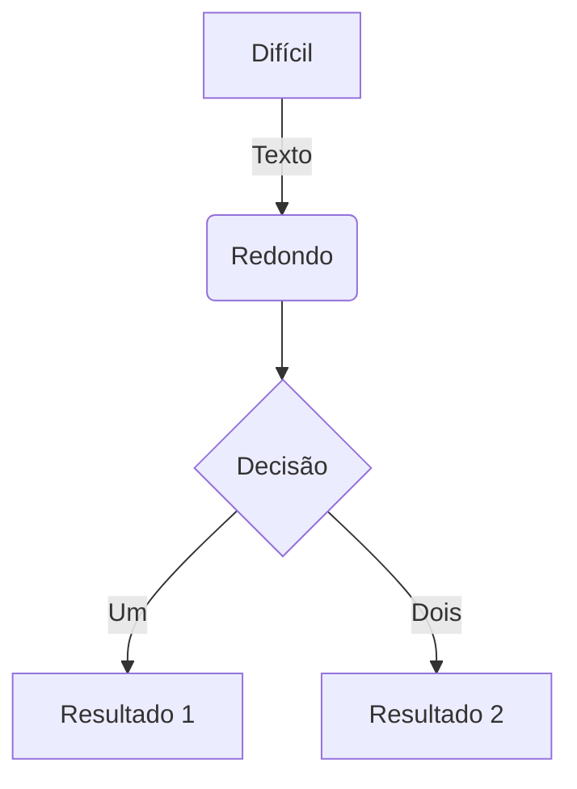
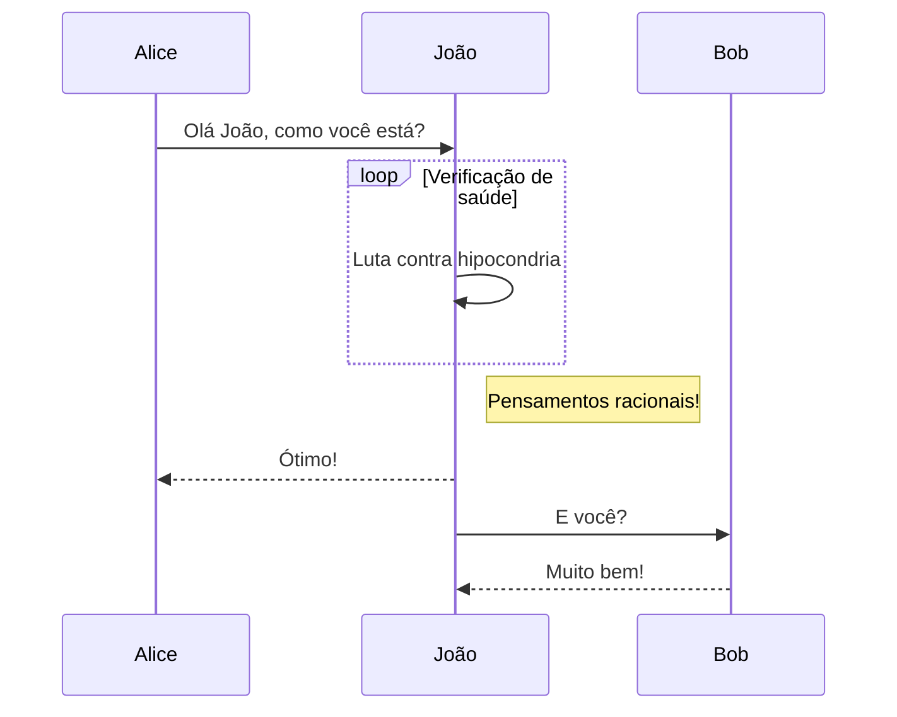
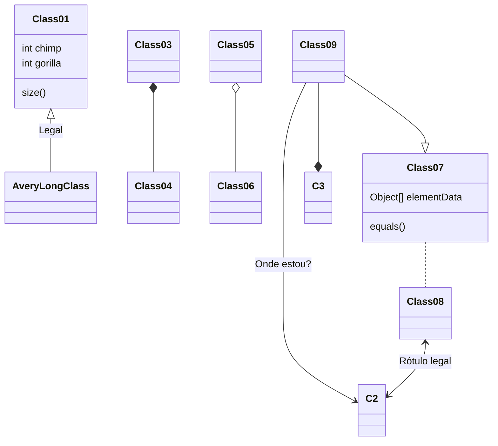
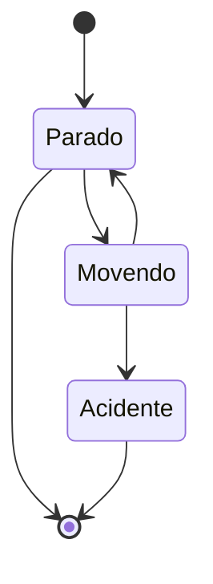

Hugo Blox é projetado para dar aos criadores de conteúdo técnico uma experiência perfeita. Você pode se concentrar no conteúdo e o Hugo Blox cuida do resto.

Use ferramentas populares como Plotly, Mermaid e data frames.

## Gráficos

Hugo Blox suporta o popular formato [Plotly](https://plot.ly/) para visualizações de dados interativas. Com Plotly, você pode projetar quase qualquer tipo de visualização que imaginar!

Salve seu JSON do Plotly na pasta da sua página, por exemplo `line-chart.json`, e então adicione o shortcode `` onde você gostaria que o gráfico aparecesse.

Demo:



Você também pode achar útil o [Editor JSON do Plotly](http://plotly-json-editor.getforge.io/).

## Diagramas

Hugo Blox suporta a extensão Markdown _Mermaid_ para diagramas.

Um exemplo de **fluxograma**:

    ```mermaid
    graph TD
    A[Difícil] -->|Texto| B(Redondo)
    B --> C{Decisão}
    C -->|Um| D[Resultado 1]
    C -->|Dois| E[Resultado 2]
    ```

renderiza como



Um exemplo de **diagrama de sequência**:

    ```mermaid
    sequenceDiagram
    Alice->>João: Olá João, como você está?
    loop Verificação de saúde
        João->>João: Luta contra hipocondria
    end
    Note right of João: Pensamentos racionais!
    João-->>Alice: Ótimo!
    João->>Bob: E você?
    Bob-->>João: Muito bem!
    ```

renderiza como



Um exemplo de **diagrama de classe**:

    ```mermaid
    classDiagram
    Class01 <|-- AveryLongClass : Legal
    Class03 *-- Class04
    Class05 o-- Class06
    Class07 .. Class08
    Class09 --> C2 : Onde estou?
    Class09 --* C3
    Class09 --|> Class07
    Class07 : equals()
    Class07 : Object[] elementData
    Class01 : size()
    Class01 : int chimp
    Class01 : int gorilla
    Class08 <--> C2: Rótulo legal
    ```

renderiza como



Um exemplo de **diagrama de estado**:

    ```mermaid
    stateDiagram
    [*] --> Parado
    Parado --> [*]
    Parado --> Movendo
    Movendo --> Parado
    Movendo --> Acidente
    Acidente --> [*]
    ```

renderiza como



## Data Frames

Salve sua planilha como um arquivo CSV na pasta da sua página e então renderize-a adicionando o shortcode _Table_ à sua página:

```go

```

renderiza como



## Você achou esta página útil? Considere compartilhá-la 🙌

