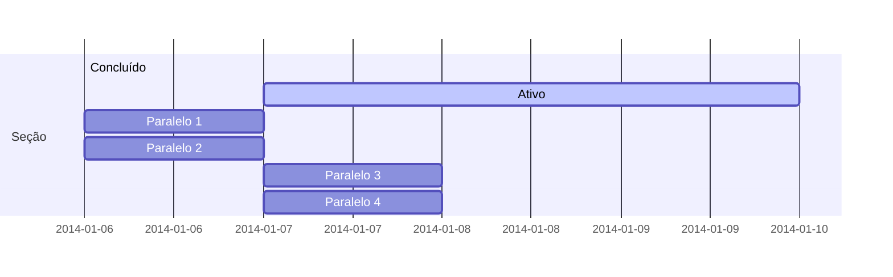

Gerencie facilmente seus projetos - crie mapas mentais de ideação, gráficos de Gantt, listas de tarefas e muito mais!

## Ideação

Hugo Blox suporta uma extensão Markdown para mapas mentais.

Simplesmente insira um bloco de código Markdown rotulado como `markmap` e opcionalmente defina a altura do mapa mental conforme mostrado no exemplo abaixo.

Mapas mentais podem ser criados simplesmente escrevendo os itens como uma lista Markdown dentro do bloco de código `markmap`, indentando cada item para criar quantos subníveis você precisar:

<div class="highlight">
<pre class="chroma">
<code>
```markmap {height="200px"}
- Módulos Hugo
  - Hugo Blox
  - blox-plugins-netlify
  - blox-plugins-netlify-cms
  - blox-plugins-reveal
```
</code>
</pre>
</div>

renderiza como

```markmap {height="200px"}
- Módulos Hugo
  - Hugo Blox
  - blox-plugins-netlify
  - blox-plugins-netlify-cms
  - blox-plugins-reveal
```

## Diagramas

Hugo Blox suporta a extensão Markdown _Mermaid_ para diagramas.

Um exemplo de **diagrama de Gantt**:

    ```mermaid
    gantt
    section Seção
    Concluído :done,    des1, 2014-01-06,2014-01-08
    Ativo        :active,  des2, 2014-01-07, 3d
    Paralelo 1   :         des3, after des1, 1d
    Paralelo 2   :         des4, after des1, 1d
    Paralelo 3   :         des5, after des3, 1d
    Paralelo 4   :         des6, after des4, 1d
    ```

renderiza como



## Listas de tarefas

Você pode até escrever suas listas de tarefas em Markdown também:

```markdown
- [x] Escrever exemplo de matemática
  - [x] Escrever exemplo de diagrama
- [ ] Fazer outra coisa
```

renderiza como

- [x] Escrever exemplo de matemática
  - [x] Escrever exemplo de diagrama
- [ ] Fazer outra coisa

## Você achou esta página útil? Considere compartilhá-la 🙌

